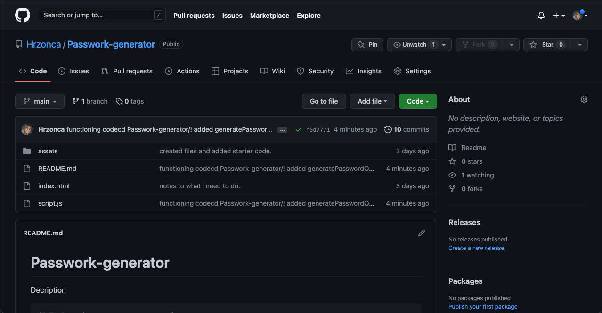
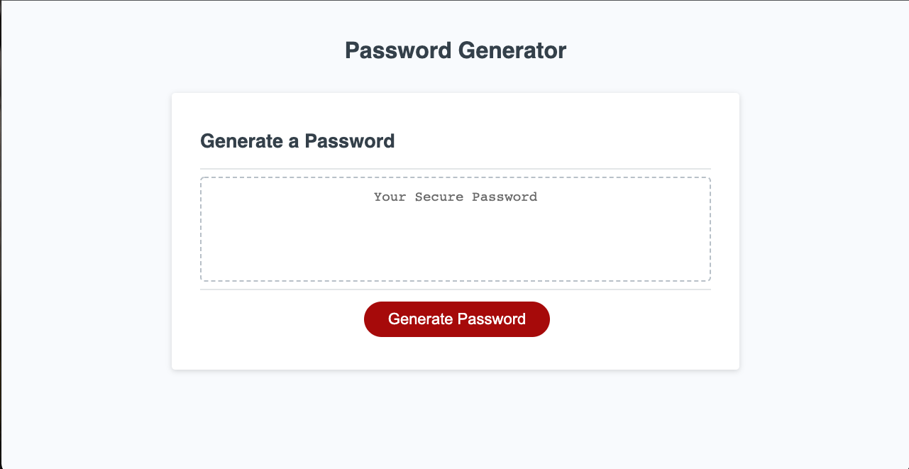

#Passward I Won't Remember Unless I Write It Down 

Decription 
The motivation for this site is to give the user the ability to generate usable password with the criteria they selected. This project allowed me to apply the Javascript information from last week's class into a functioning website. 

I learned a lot while struggling through this. the functions that were used heped me think in a more logical way for building the site. i expanded my knowledge of arrays and understanding that within a function you can create another array to push the user options to inorder for that information to be translated into a password. by using for loops i am able to randomize the global arrays and use them in local arrays. 

Repository link
https://github.com/Hrzonca/Passwork-generator

Live page link 
https://hrzonca.github.io/Passwork-generator/

Credits
Triology Education Services
Univeristy of Washington Full Stack Bootcamp

License
MIT license 
